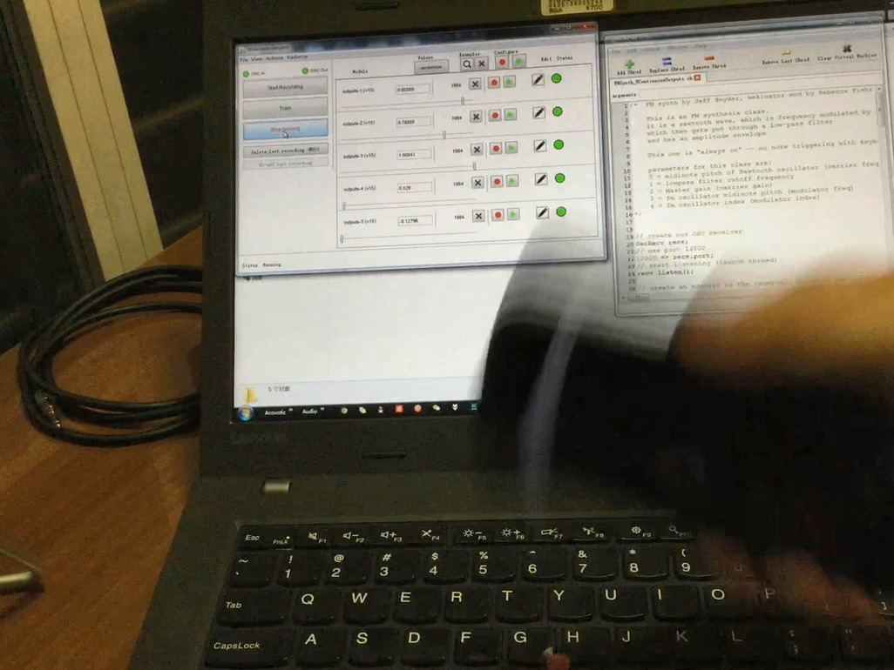
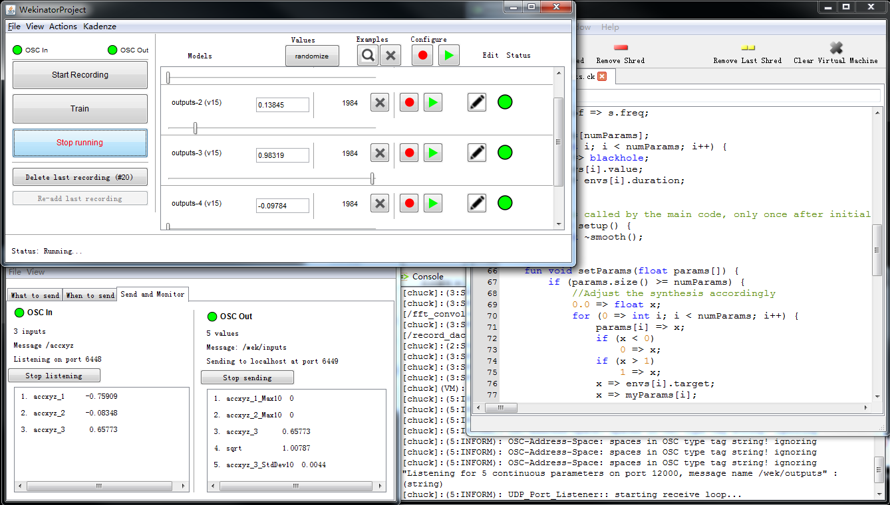

# shakeFM

An OSC-based remote control FM synthesizer based on Wekinator

**See video demo [here](https://youtu.be/rLEmL9Iut3o).**

-------

## Introduction

There are 5 parameters to be affected in the output FM synthesizer, including the frequency of carrier, cutoff of the low pass filter, gain of the carrier, frequency of the modulator, and depth of the modulation. Based on the connection map of my model, I chose different algorithms for different outputs. Basically, if the output is connected to several inputs, I tend to choose neural network to train the models and try different layers and nodes within them. This could generate a more complex model to change the output in a subtle way. And some of output parameters are only linked to one input, in such case I would like to try the polynomial regression algorithm and choose different order based on the complexity of the trend. As a result, this offers a more accurate control to the desired parameters.

BTW, **shake it hard**, and you will get the best damn sound. 

-------

## Instructions

1. Install TouchOSC app on the phone and WekiInputHelper on the PC/Mac you are running.
2. Make sure that they are connected to the same Wifi network.
3. Download AccelorateOnly.touchosc file into your phone via TouchOSC Editor and set the IP address in TouchOSC app, by default the WekiInputHelper uses 6448 as input port, which you should set as the outgoing port on the phone.
4. Open WekiInputHelper and load Shakndroid.inputproj.
5. Run the ChucK project in the Miniaudicle or in command line.
6. Open Wekinator and run the project.

-------

## Credits

* TouchOSC and TouchOSC Editor: https://hexler.net/software/touchosc

* Wekinator and WekiInputHelper: http://www.wekinator.org/

* Chuck and MiniAudicle: https://chuck.cs.princeton.edu/

* FM synth by Jeff Snyder.
